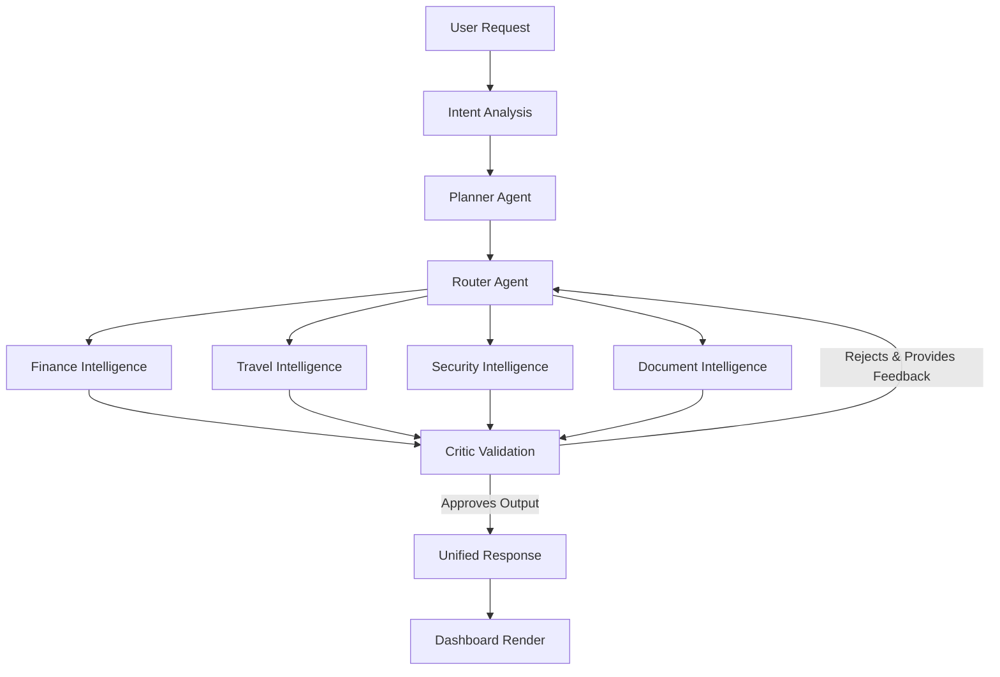

<div align="center">

# 🪐 LifeOS AI

**An intelligent multi-agent operating system that coordinates specialised AI agents to transform complex user requests into structured, actionable outcomes.**

[]()  []()  []()  []()  []()  []()  []()  []()  []() []()

</div>

---

## 🌟 Overview

**LifeOS AI** is an advanced, multi-agent artificial intelligence operating system.

While traditional AI chatbot interfaces restrict users to linear, conversational outputs, real-world digital workflows—such as planning travel, managing personal finances, or assessing security risks—require parallel processing, task decomposition, and verifiable accuracy.

LifeOS AI solves this by introducing a robust orchestrator that fundamentally changes how AI interacts with tasks. A single plain-language request is parsed, planned, and routed dynamically to specialized AI agents working concurrently. Their outputs are then independently validated by a Critic agent, which can enforce retries if requirements aren't met, ultimately synthesizing an actionable, unified report inside an editorial-quality UI.

---

## 🚀 Key Features

| Feature | Description | Purpose |
| --- | --- | --- |
| **Multi-Agent Orchestration** | Engine that coordinates Intent, Planner, Router, Critic, and Response agents. | Eliminates single-model hallucination by delegating tasks. |
| **Intelligent Task Planning** | Decomposes complex queries into ordered, actionable sub-tasks. | Processes workflows step-by-step accurately. |
| **AI Routing** | Evaluates sub-tasks and dispatches to relevant domain agents concurrently. | Drastically reduces execution latency. |
| **Unified Reports** | Synthesizes asynchronous agent JSON outputs into a cohesive user response. | Provides a readable, integrated conclusion. |
| **Finance Intelligence** | Specialized module for financial evaluation and budget enforcing. | Keeps user constraints protected. |
| **Travel Intelligence** | Specialized module for routing, itineraries, and trip structuring. | Generates rich, localized travel plans. |
| **Security Intelligence** | Specialized module for identifying operational and cyber risks. | Protects decisions from vulnerability. |
| **Document Intelligence** | Validates structured data and parses context limitations. | Ensures robust input handling. |
| **Responsive UI** | High-fidelity Next.js interface with zero layout shift mapping. | Delivers a premium, native-app feel. |
| **Theme System** | Seamlessly integrates CSS properties for light/dark contrast mapping. | Reduces eye strain and promotes accessibility. |
| **Demo Mode** | Flawless fallback scripts for isolated testing without live LLM costs. | Ensures reliable evaluation conditions. |
| **Modern Dashboard** | Clean, minimalist data visualizations of the unified result cards. | Presents dense data beautifully. |
| **AI Workspace** | Live pipeline visualization showing per-agent timings and retry loops. | Demystifies the "black box" of AI execution. |

---

## 🧠 Why LifeOS AI?

LifeOS AI was designed with a **human-centered** philosophy, aiming to bridge the gap between abstract LLM responses and concrete software execution.

* **Modular Architecture**: New specialist agents can be plugged into the `backend/app/services/agents/` directory without altering the core router.
* **Extensibility**: The system is framework-agnostic. Integrating new API providers (OpenAI, Gemini, Anthropic) or external hooks is seamless.
* **AI Collaboration**: Agents don't just generate text; they generate typed schemas which the Critic validates dynamically.
* **Scalability**: Stateless FastAPI processing and concurrent execution ensure high throughput without locking the event loop.

---

## 🏗️ Architecture Overview

The system processes every request through an immutable, self-correcting pipeline:



---

## 🔄 Workflow

1. **Classification (Intent)**: The system analyzes the input to determine the domains involved and the required confidence threshold.
2. **Decomposition (Planner)**: The query is broken down into discrete steps.
3. **Dispatch (Router & Specialists)**: Tasks are routed instantly to the respective agents (e.g., Travel and Finance), which run **in parallel**.
4. **Validation (Critic)**: Every response is audited against the user's constraints. If an agent fails to provide a specific breakdown, the Critic rejects it and re-runs the agent with feedback.
5. **Synthesis (Response)**: Validated JSON payloads are aggregated into a single, beautifully rendered dashboard update.

---

## 📁 Project Structure

```text
project/
├── backend/                  # FastAPI Application
│   ├── app/                  
│   │   ├── schemas/          # Pydantic wire contracts (Mirrors TypeScript)
│   │   └── services/         
│   │       ├── agents/       # Agent modules (Finance, Travel, Security, Document, Critic)
│   │       ├── orchestrator.py # Core LifeCore execution pipeline
│   │       └── lyzr_client.py  # Provider abstraction and fallback chain
│   ├── contract_test.py      # Contract validation tests
│   └── smoke_test.py         # Full pipeline integration tests
├── frontend/                 # Next.js 14 App Router
│   ├── app/                  # Main UI layouts, pages, and API proxy routes
│   ├── components/           # Reusable UI elements (Trace, Cards, Action Center)
│   └── lib/                  
│       └── supabase/         # Client, Server, and Middleware Supabase configs
└── supabase/                 # Database Schema
    └── schema.sql            # Idempotent 9-table schema with strict RLS
```

---

## 🛠️ Technology Stack

| Layer | Choice | Rationale |
|---|---|---|
| **Frontend** | Next.js 14 (App Router), React 18 | Excellent server-side rendering support and backend API proxying natively. |
| **Backend** | FastAPI + Uvicorn, Python 3.11 | Performant async execution tailored for orchestration and AI integration. |
| **Database** | Supabase (Postgres) | Robust relational modeling seamlessly paired with row-level security policies. |
| **Authentication** | Supabase Auth (`@supabase/ssr`) | Secure, session-backed email/password management. |
| **AI** | Groq (Llama-3.3-70b-versatile) | Exceptional inference speed supporting massive parallel processing. |
| **Styling** | Tailwind CSS | Fast, deterministic utility-class styling adapting flawlessly to themes. |
| **Deployment** | Vercel (Front) / Render (Back) | Serverless frontend integration combined with a stable backend container. |

---

## 🎨 UI Showcase

LifeOS AI was crafted to replicate a flagship editorial experience.
* **Landing Page**: Striking, minimalist entry point outlining the product vision.
* **AI Workspace**: A clean operational layout where user input commands center stage.
* **Agent Pipeline**: Real-time tracer that renders milliseconds, parallel states, and Critic interventions visually.
* **Cards & Dashboard**: Rich, data-centric views handling the unified intelligence responses elegantly.
* **Responsive Layout & Dark Theme**: A fully responsive application optimizing viewing comfort and screen territory management across devices.

---

## 🎭 Demo Mode

To guarantee a stable and highly illustrative evaluation experience, LifeOS AI ships with a sophisticated **Demo Mode**. 
When LLM backend variables are unset, the system intelligently defaults to executing internal fallback scripts. These scripts emulate the entire orchestration procedure—including intentional agent failures and Critic retries—providing a live demonstration of the multi-agent orchestration architecture without encountering API rate limits or network latency.

### ⚠️ Mock Data Notice (IMPORTANT)
For this hackathon MVP, **representative mock data is intentionally used in selected workflows** during Demo Mode. 
Given the constraints of hackathon development timelines and the extensive effort required to provision, secure, and integrate numerous third-party endpoints, these mocks serve to **validate the orchestration architecture and user experience**.
The application’s underlying design is fully capable of processing live integrations; however, this fallback mechanism strategically keeps the MVP stable, reliable, and demonstratable under evaluation conditions.

---

---

## ⚙️ Installation

### 1. Backend

```bash
cd backend
python -m venv .venv
# Windows: .venv\Scripts\activate | macOS/Linux: source .venv/bin/activate
pip install -r requirements.txt
cp .env.example .env
python -m uvicorn app.main:app --reload --port 8000
```

### 2. Database
- Create a Supabase project.
- Open the SQL Editor and paste all of [`supabase/schema.sql`](supabase/schema.sql), then execute.

### 3. Frontend

```bash
cd frontend
npm install
cp .env.example .env.local
# Proceed to fill in your Supabase URL & Anon Key
npm run dev
```

---

## 🔐 Environment Variables

**`frontend/.env.local`**

| Variable | Description |
|---|---|
| `NEXT_PUBLIC_SUPABASE_URL` | Your Supabase project URL |
| `NEXT_PUBLIC_SUPABASE_ANON_KEY` | Your Supabase public key |
| `BACKEND_API_BASE_URL` | Backend server url (Default: `http://localhost:8000`) |
| `RESEND_API_KEY` | (Optional) Enabling email delivery |

**`backend/.env`**

| Variable | Description |
|---|---|
| `LLM_BACKEND` | Use `mock` to force Demo Mode fixtures |
| `GROQ_API_KEY` | (Optional) Active Groq inference key |
| `GROQ_MODEL` | (Optional) Defaults to `llama-3.3-70b-versatile` |

### Demo Credentials
On a fresh database seed, use the standard demo credentials displayed locally on the login portal:
- Email: `judge@lifeos.ai`
- Password: `lifeos-demo`

---

## 🧠 AI Pipeline Components

- **Planner**: Evaluates input and strictly dictates execution steps.
- **Router**: Invokes agents explicitly based on Planner schemas.
- **Specialists**: Independent modules (Finance, Travel, Document, Security).
- **Critic**: Evaluates specialist outputs aggressively based on internal constraints and user safety.
- **Report Generator**: Consolidates Critic-approved payloads into frontend-compatible structures.

---

## 🗺️ Roadmap

- **Completed**: Core Orchestrator, Demo Scenarios, UI Pipeline Tracer, Basic Specialists, RLS Database Schema.
- **In Progress**: Full Session Memory indexing and comprehensive action hooks.
- **Future Vision**: Expanding intelligences (Meeting, Productivity, Decision metrics), shared collaborative travel groups, enterprise API synchronization, and completely detached mobile environments.

---

## ⚡ Performance & Design Philosophy

LifeOS prioritizes **clarity, organization, coordination, and decision support**. The user interface sheds complex knobs and levers in favor of **human-first AI**, emphasizing legibility and typographical hierarchy. Modular components guarantee a highly scalable design, while the backend utilizes asynchronous multi-threading to parallelize specialist agents, returning complex workflows in mere seconds.

---

## 🏆 Hackathon Context

LifeOS AI was meticulously developed as a hackathon MVP to demonstrate an extensible multi-agent AI operating system capable of coordinating specialized intelligence modules around real-world productivity workflows. 
The current implementation purposefully prioritizes verifiable architectural correctness, premium user experience, and reliable system demonstration within the stringent time constraints of the event.

---

## 🤝 Contributing

Contributions to scale additional intelligence modules are welcome. Please ensure your new Agent extends `BaseAgent` and respects the Critic validation cycle.

---

## 📄 License

This project operates under the **MIT License**.

---
*Developed with focus and precision for InnovaHack.*
